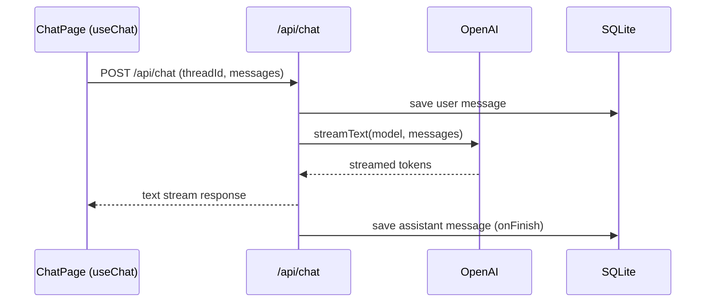

## AI Chat (Next.js + Bun + SQLite)

### Setup

- Install dependencies: `bun install`
- Allow native SQLite bindings:
  - `bun pm trust better-sqlite3`
  - `bun install`
- Add the sample workbook:
  - `mkdir data`
  - place `example.xlsx` at `./data/example.xlsx`
- Set your API key in `./.env.local`:
  - `OPENAI_API_KEY=...`

### Bun Commands

- `bun dev` run the dev server
- `bun run build` build for production
- `bun start` start the production server
- `bun lint` lint

### Database Initialization

- SQLite initializes automatically on first request.
- Default DB path: `./data/app.db` (override with `SQLITE_PATH`).

### XLSX Location

- XLSX tools read/write `./data/example.xlsx`.
- The app will error if the file is missing.

### Status

**Fully implemented**
- Chat threads + messages persisted in SQLite.
- Streaming responses via `/api/chat`.
- Thread creation, switching, and deletion.
- XLSX tools: `getRange`, `updateCell` (confirmation-gated), `explainFormula`.

**Partially implemented**
- Generative UI tool rendering (confirm card is wired; other tool UIs are basic).
- Table modal uses sample data (not yet wired to XLSX preview).

**Limitations**
- No auth or multi-user isolation.
- XLSX updates are direct file writes (single-writer expected).
- Tooling is enabled only when prompts include `@Sheet!A1:B3` range references.

### Requirement Mapping

**Meets**
- Next.js 16 App Router + TypeScript.
- Thread list, create, switch, delete; messages persisted in SQLite.
- `/api/chat` integrated with `useChat` and streaming.
- README covers setup/run/db/xlsx.

**Not fully met**
- Bun built‑in SQLite (`bun:sqlite`) is not used; current driver is `better-sqlite3`.
- Generative UI tools are partially wired; only confirmation UI is fully interactive.
- XLSX end‑to‑end flow is incomplete:
  - tool results are not rendered as tables in chat,
  - table modal uses sample data instead of XLSX output,
  - range mentions are not fully interpreted into tool calls.

**What’s needed to reach full compliance**
- Replace DB driver with Bun’s built‑in `bun:sqlite`.
- Wire tool results into chat UI (table previews + click‑to‑open modal).
- Feed XLSX tool output into the modal grid and selection.
- Parse `@Sheet!A1:B3` mentions and invoke XLSX tools consistently.

### Request/Response Flow

